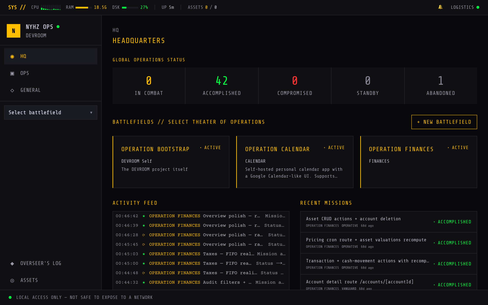
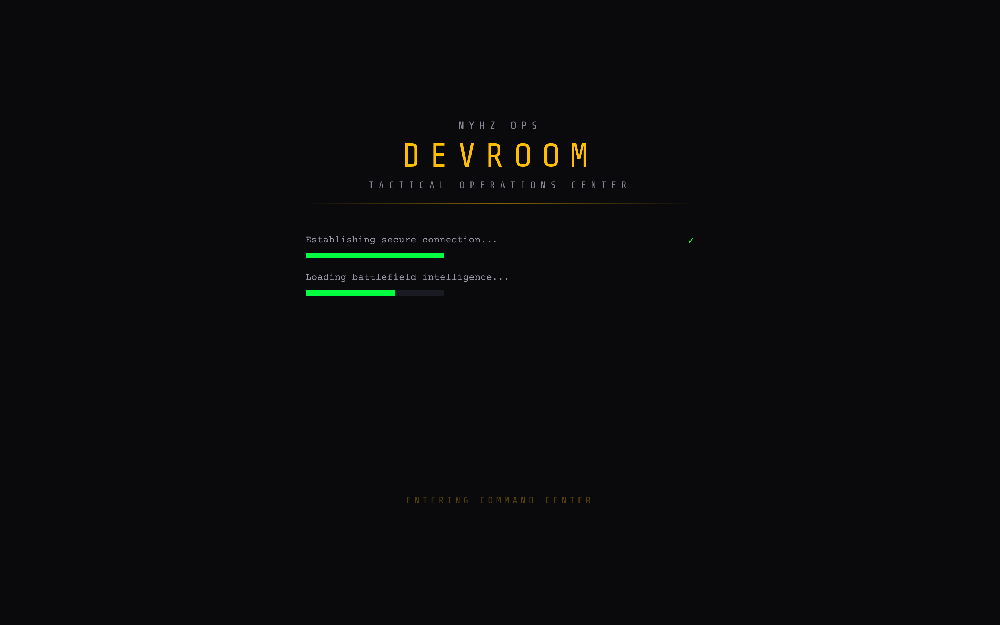
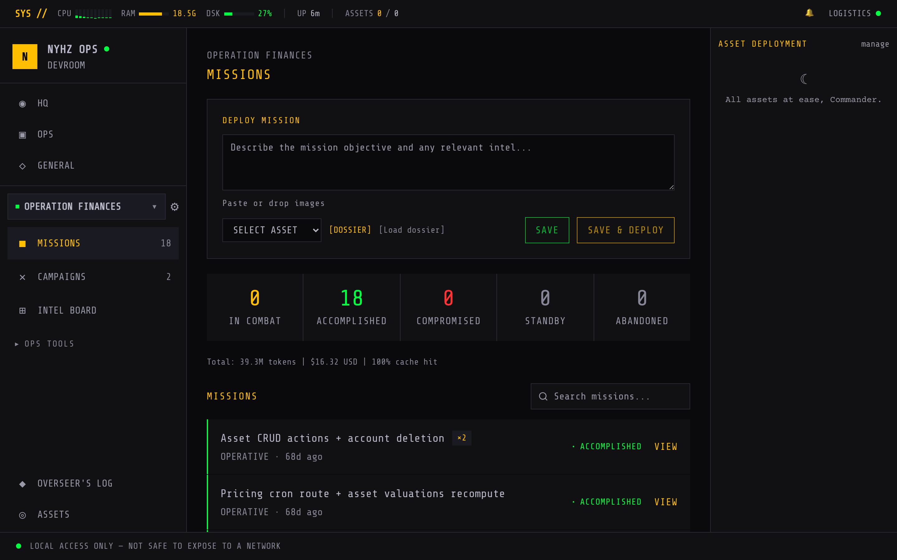
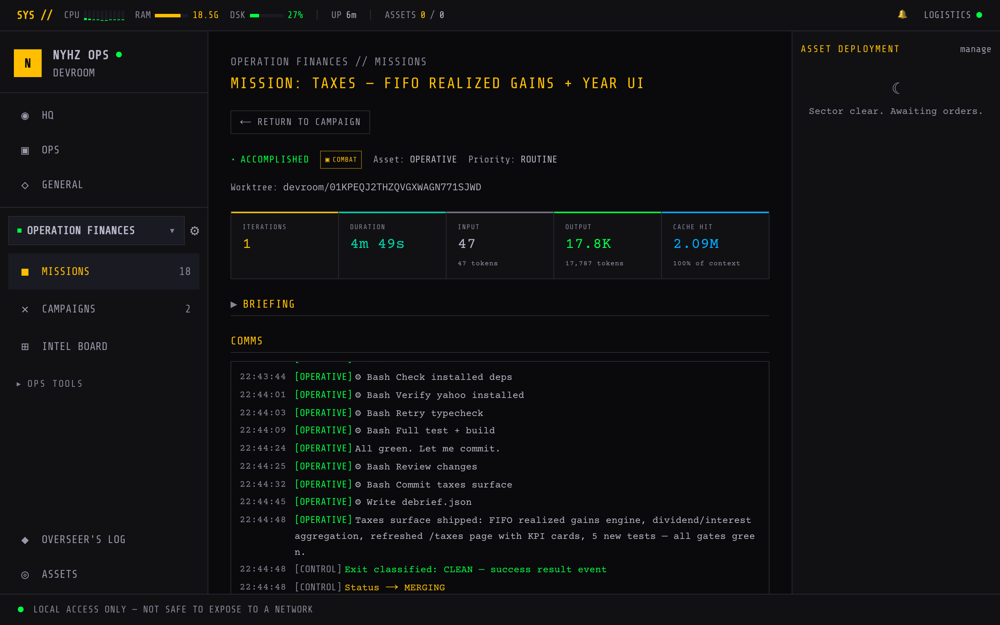
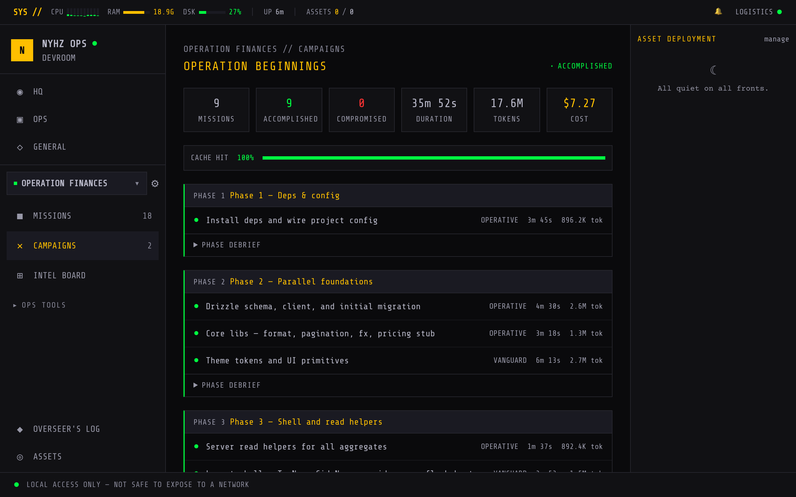
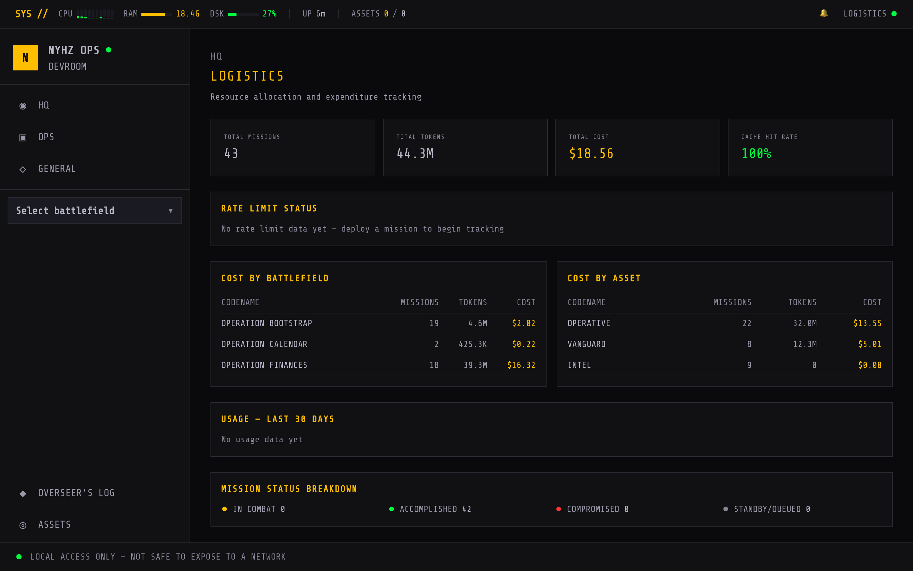
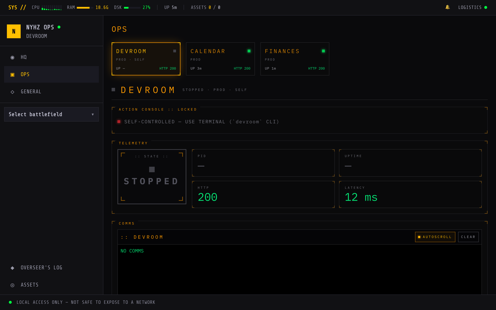
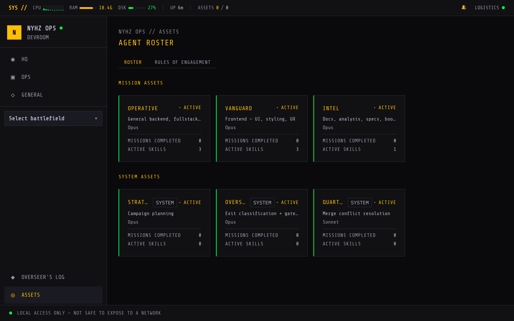
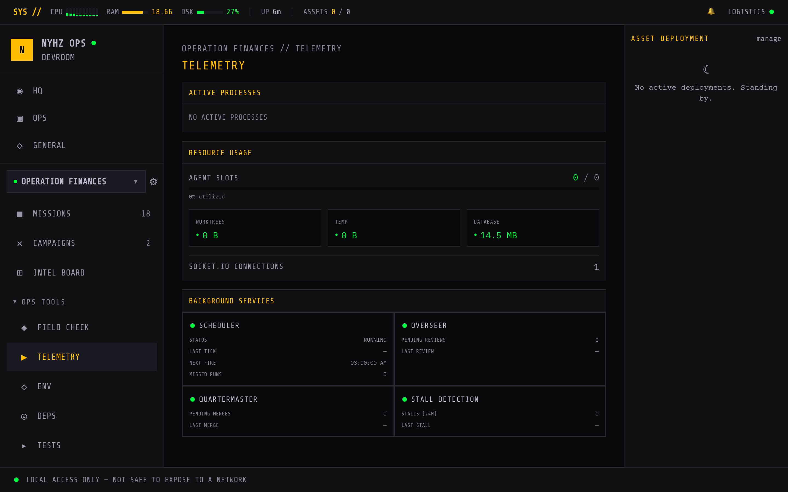

```
 ██████╗ ███████╗██╗   ██╗██████╗  ██████╗  ██████╗ ███╗   ███╗
 ██╔══██╗██╔════╝██║   ██║██╔══██╗██╔═══██╗██╔═══██╗████╗ ████║
 ██║  ██║█████╗  ██║   ██║██████╔╝██║   ██║██║   ██║██╔████╔██║
 ██║  ██║██╔══╝  ╚██╗ ██╔╝██╔══██╗██║   ██║██║   ██║██║╚██╔╝██║
 ██████╔╝███████╗ ╚████╔╝ ██║  ██║╚██████╔╝╚██████╔╝██║ ╚═╝ ██║
 ╚═════╝ ╚══════╝  ╚═══╝  ╚═╝  ╚═╝ ╚═════╝  ╚═════╝ ╚═╝     ╚═╝
                    N Y H Z   O P S
```


**Autonomous Agent Orchestrator — Tactical Operations Center**

> *"Speed, surprise, and violence of action."* — Delta Force doctrine

DEVROOM is a self-hosted command center that deploys, coordinates, and monitors autonomous [Claude Code](https://docs.anthropic.com/en/docs/claude-code) agents across your codebases. It runs on your local network — brief your missions from any device, watch your operators execute in real-time, and let CONTROL handle verification and merges while you plan the next strike.

One Commander. Multiple agents. Total operational awareness.

<p align="center">
  
  <br>
  <sub><b>HQ</b> — global operations status, the battlefield grid, and a live activity feed. One screen, total awareness.</sub>
</p>

---

## Operational Doctrine

You are the **Commander**. Every codebase under your control is a **Battlefield**. When a target needs engaging, you draft a **Mission** briefing — a Claude Code process drops into an isolated git worktree with clear objectives, rules of engagement, and an **Asset** (specialized agent) assigned to the operation.

For coordinated strikes across multiple objectives, you plan a **Campaign**. Brief the **STRATEGIST** — your planning specialist — through an interactive chat. Discuss phases, priorities, constraints. When the plan is solid, hit **GREEN LIGHT**. Phases execute in sequence. Missions within each phase deploy in parallel. Maximum firepower, minimum collateral.

When an operator completes their mission, **CONTROL** runs the gate suite — lint, typecheck, build, test — against the work. Gates pass, work merges automatically. If something goes wrong, CONTROL retries deterministically, consults the Overseer only when the system hits its limits, and escalates to the Commander when human judgment is needed.

Every mission. Every gate result. Every token spent. Logged, tracked, and reported back to Command.

---

## Capabilities

### Mission Deployment

- **Rapid deployment** — Write a briefing, assign an asset, set priority, deploy
- **Isolated worktrees** — Every mission gets its own git branch and worktree. No cross-contamination. Clean merges on success
- **Live comms** — Real-time streaming output from running agents via Socket.IO
- **Concurrency control** — Configurable parallel agent slots with automatic queue management and rate-limit backoff
- **Gate enforcement** — Deterministic lint/typecheck/build/test verification before merge
- **Recon missions** — Read-only scouting missions that produce prose reports without worktrees or merges
- **Mission templates (Dossiers)** — Pre-built briefing templates with variable placeholders for repeat operations

### Campaign Operations

- **Multi-phase campaigns** — Sequential phases, parallel missions within each phase
- **Interactive briefing** — Plan campaigns conversationally with the STRATEGIST asset
- **Plan generation** — STRATEGIST structures your conversation into phases and missions with asset assignments
- **Visual plan editor** — Reorder phases and missions, reassign assets, adjust priorities before launch
- **Live campaign timeline** — Track progress across all phases in real-time
- **Auto phase transitions** — Next phase begins when current phase is secured
- **Stall detection** — Automatic detection and handling of stuck phases

### CONTROL — Mission Supervisor

- **Deterministic gate enforcement** — lint, typecheck, build, and test run against every completed mission before merge
- **Bounded retry policy** — 3 deterministic retries + 1 OVERSEER redirect before escalation
- **Exit classification** — Fast-path regex classifier with OVERSEER fallback for ambiguous exits
- **Liveness monitoring** — L1 exit / L3 silence / L5 wall-clock / L6 watchdog checks keep missions from going dark
- **Auto-commit sweep** — Detects and commits uncommitted agent work before gate evaluation
- **Startup recovery and watchdog healing** — Recovers interrupted missions on service restart

### Quartermaster — Integration Specialist

- **Automated rebase-then-merge** — Approved work is rebased and merged into the target branch under a merge lock
- **One-shot conflict resolution** — Spawns QUARTERMASTER to resolve merge conflicts; no retries
- **Worktree cleanup** — Removes worktrees and branches after successful merge

### Intelligence & Monitoring

- **HQ Dashboard** — Global operations status, battlefield grid, activity feed, recent missions
- **Overseer's Log** — Searchable audit trail of all review verdicts and escalations
- **Logistics** — Token usage, cost breakdown by battlefield and asset, 30-day usage chart, rate limit status
- **Notifications** — In-app alerts for status changes, escalations, and system events with DB-capped retention
- **Telegram integration** — Real-time escalation alerts with inline action buttons (approve, retry, abort, skip, resume)
- **Intel Board** — Per-battlefield kanban board for mission tracking and backlog planning
- **General Chat** — Standalone chat interface for ad-hoc questions and recon
- **Field Check** — Per-battlefield health and readiness diagnostics
- **Telemetry** — Mission exit analysis and success rate tracking
- **Test Runner** — Per-battlefield test execution with one-click fix deployment

### Battlefield Operations

- **Automatic worktree lifecycle** — Create on deploy, merge on success, cleanup on completion
- **Branch management** — Status, commit log, and branch listing per battlefield
- **Dev server management** — Auto-start dev servers for battlefields with the flag enabled
- **Scheduled tasks** — Cron-based recurring missions per battlefield
- **Environment management** — Per-battlefield env file editing and creation
- **Dependency tracking** — Package dependency viewer per battlefield

### War Room

First visit triggers a tactical boot sequence — progress bars filling, systems coming online, status checks reporting in. Because you don't just open a dashboard. You enter the command center.

```
NYHZ OPS
D E V R O O M

[████████████████████████████████] Establishing secure connection...
[████████████████████████████████] Loading battlefield intelligence...
[████████████████████████████████] Recovering active campaigns...
[████████████████████████████████] Contacting deployed assets...

> BATTLEFIELDS ONLINE .............. 3 active
> ASSETS DEPLOYED ................. 2 in combat
> CONTROL ON STATION .............. standing by
> ALL SYSTEMS NOMINAL

          [ ENTER COMMAND CENTER ]
```

---

## Screen Recon

<table>
  <tr>
    <td width="50%" valign="top">
      
      <br><sub><b>War Room</b> — the tactical boot sequence that plays on first contact each session.</sub>
    </td>
    <td width="50%" valign="top">
      
      <br><sub><b>Battlefield</b> — draft a briefing, assign an asset, and scan the roster of completed ops.</sub>
    </td>
  </tr>
  <tr>
    <td width="50%" valign="top">
      
      <br><sub><b>Mission</b> — live comms stream, token telemetry, and CONTROL's gate verdicts in real time.</sub>
    </td>
    <td width="50%" valign="top">
      
      <br><sub><b>Campaign</b> — sequential phases, parallel missions, debriefs rolled up per phase.</sub>
    </td>
  </tr>
  <tr>
    <td width="50%" valign="top">
      
      <br><sub><b>Logistics</b> — token usage and cost broken down by battlefield and asset.</sub>
    </td>
    <td width="50%" valign="top">
      
      <br><sub><b>OPS</b> — managed-app control panel with per-app telemetry and live comms.</sub>
    </td>
  </tr>
  <tr>
    <td width="50%" valign="top">
      
      <br><sub><b>Assets</b> — the agent roster: combat operators and autonomous system staff.</sub>
    </td>
    <td width="50%" valign="top">
      
      <br><sub><b>Telemetry</b> — background-service health, agent slots, and resource usage per battlefield.</sub>
    </td>
  </tr>
</table>

---

## Asset Roster

### Mission Assets — the operators you deploy

| Codename | Specialty | Role |
|----------|-----------|------|
| **OPERATIVE** | Backend / General | Backend engineering, general-purpose coding |
| **VANGUARD** | Frontend | Frontend engineering with design capability |
| **INTEL** | Documentation | Docs, bootstrap, project intelligence |

### System Assets — autonomous support staff

| Codename | Role | Model | Operates |
|----------|------|-------|----------|
| **STRATEGIST** | Campaign planning specialist | Claude Opus 4.6 | Interactive briefing chat, plan generation |
| **OVERSEER** | Exception-only exit classifier + gate-failure consultant | Claude Sonnet 4.6 | Ambiguous exit classification, repeated gate-failure consult |
| **QUARTERMASTER** | One-shot merge conflict resolver | Claude Sonnet 4.6 | Worktree merging, conflict resolution |

All combat assets follow strict **Rules of Engagement** including mandatory commit discipline, structured DEBRIEF block emission, and gate-command awareness. CONTROL enforces these deterministically — prompts are advisory, the system is the guarantee.

---

## Dossier Templates

Pre-built mission briefing templates with configurable variables for repeat operations:

| Codename | Operation Type | Default Asset |
|----------|---------------|---------------|
| **BLACKSITE** | Security Audit | OPERATIVE |
| **TRIBUNAL** | Code Review | INTEL |
| **RESUPPLY** | Dependency Update | OPERATIVE |
| **GHOSTRIDER** | Performance Audit | OPERATIVE |
| **TRIAGE** | Bug Fix | OPERATIVE |
| **IRONFORGE** | Feature Implementation | OPERATIVE |
| **ARCHIVE** | Documentation Update | INTEL |
| **CLEAN SWEEP** | Refactor Module | OPERATIVE |
| **WARPAINT** | Frontend Component | VANGUARD |

---

## Architecture

```
┌─────────────────────────────────────────────────────────┐
│                    COMMANDER (You)                       │
│              Browser on any LAN device                   │
├─────────────────────────────────────────────────────────┤
│                                                         │
│   Next.js App Router                                    │
│   ├── Server Components (data display, DB queries)      │
│   ├── Client Components (Socket.IO, forms, terminals)   │
│   ├── Server Actions (all mutations)                    │
│   └── Route Handlers (stream endpoints)                 │
│                                                         │
├──────────────┬──────────────┬───────────────────────────┤
│  SQLite DB   │  Socket.IO   │   CONTROL Supervisor      │
│  (Drizzle)   │  (real-time) │   ├── Dispatch Loop       │
│              │              │   ├── Mission Runner       │
│              │              │   ├── Exit Classifier      │
│              │              │   ├── Gate Enforcer        │
│              │              │   ├── Retry Policy         │
│              │              │   ├── Liveness Monitor     │
│              │              │   ├── Watchdog             │
│              │              │   └── Merge + QM path      │
├──────────────┴──────────────┴───────────────────────────┤
│                                                         │
│   Claude Code CLI Processes                             │
│   ├── Mission agents (isolated worktrees)               │
│   ├── STRATEGIST (campaign planning)                    │
│   ├── OVERSEER (exception-only classification + consult)│
│   ├── QUARTERMASTER (conflict resolution)               │
│   └── Bootstrap agents (CLAUDE.md + SPEC.md gen)        │
│                                                         │
├─────────────────────────────────────────────────────────┤
│         Git Repositories (Battlefields)                 │
│         └── Worktrees per mission                       │
└─────────────────────────────────────────────────────────┘
```

### Tech Stack

| Layer | Technology |
|---|---|
| Runtime | Node.js 20+ |
| Framework | Next.js 16.2 (App Router + Turbopack) |
| Language | TypeScript (strict mode) |
| Styling | Tailwind CSS 4 — custom tactical theme |
| Primitives | shadcn/ui (restyled) |
| Database | SQLite via better-sqlite3 (synchronous, WAL mode) |
| ORM | Drizzle ORM 0.45 |
| Real-time | Socket.IO 4.8 |
| Agent Runtime | Claude Code CLI via `child_process.spawn` |
| Git | simple-git (worktrees, merges) |
| IDs | ULID (lexicographically sortable, timestamp-embedded) |
| Testing | Vitest + Playwright |

---

## Operational Terminology

Everything has a codename. This isn't a project management tool — it's a tactical operations center.

| Civilian Term | Codename | Function |
|---|---|---|
| Project | **Battlefield** | A git repository under DEVROOM control |
| Setup | **Bootstrap** | Initial recon — generates CLAUDE.md + SPEC.md for a new battlefield |
| Task | **Mission** | A single Claude Code agent execution |
| Task Group | **Campaign** | Multi-phase operation with sequential phases |
| Phase | **Phase** | A campaign step — its missions run in parallel |
| Agent Profile | **Asset** | Specialty + system prompt + model assignment |
| Result | **Debrief** | Post-mission summary report, addressed to the Commander |
| Logs | **Comms** | Real-time output stream from a running mission |
| Template | **Dossier** | Reusable mission briefing with variable slots |
| Mission Supervisor | **CONTROL** | Deterministic gate enforcement, retry policy, liveness, auto-merge |
| Exception Classifier | **Overseer** | Exit classification + gate-failure consult on exception paths |
| Merge Specialist | **Quartermaster** | One-shot conflict resolver for merge failures |
| Dashboard | **HQ** | Main overview screen |
| Alert | **Notification** | In-app + Telegram alert |
| Planning Chat | **Briefing** | Interactive campaign planning with STRATEGIST |
| Cost Tracking | **Logistics** | Token usage, rate limits, cost dashboard |
| Boot Sequence | **War Room** | Tactical startup animation |

### Mission Lifecycle

```
STANDBY ─── QUEUED ─── DEPLOYING ─── IN COMBAT ─── MERGING ─── ACCOMPLISHED
                                          │              │
                                          ▼              ▼
                                      COMPROMISED    COMPROMISED
                                      (retry budget  (merge
                                       exhausted)     failed)
```

ABANDONED only by Commander action. No autonomous abort.

### Status Indicators

| Status | Color | Meaning |
|---|---|---|
| `INITIALIZING` | blue | Battlefield bootstrapping |
| `STANDBY` | dim | Created, not yet queued |
| `QUEUED` | muted | Waiting for an agent slot |
| `DEPLOYING` | amber | Setting up worktree |
| `IN COMBAT` | amber | Agent actively running |
| `MERGING` | amber | CONTROL merging worktree |
| `ACCOMPLISHED` | green | Mission complete |
| `COMPROMISED` | red | Retry budget exhausted or merge failed — Commander decides next |
| `ABANDONED` | dim | Cancelled by Commander |

---

## Deployment

### Prerequisites

- **Node.js 20+** and **pnpm**
- **Claude Code CLI** installed and authenticated ([docs](https://docs.anthropic.com/en/docs/claude-code))
- A git repository to use as your first battlefield

### Installation

```bash
git clone https://github.com/Nyhz/nyhzops-devroom.git
cd nyhzops-devroom
pnpm install
```

### Configuration

Copy `.env.example` to `.env.local` and configure:

```bash
# Required
DEVROOM_PORT=7777
DEVROOM_CLAUDE_PATH=claude               # Path to your Claude Code binary

# Recommended for unattended operation
CLAUDE_CODE_OAUTH_TOKEN=                  # From `claude setup-token` (valid ~1 year)

# Optional — Telegram escalation alerts
DEVROOM_TELEGRAM_BOT_TOKEN=your-bot-token
DEVROOM_TELEGRAM_CHAT_ID=your-chat-id
DEVROOM_TELEGRAM_ENABLED=true

# Tuning
DEVROOM_MAX_AGENTS=5                      # Max parallel missions (default: 5)
DEVROOM_LOG_LEVEL=info                    # debug | info | warn | error
```

### Database Setup

```bash
pnpm db:migrate    # Apply migrations
pnpm seed          # Seed default assets and dossiers
```

### Launch

```bash
# Development (hot reload via Turbopack)
pnpm dev

# Production
pnpm build && pnpm start
```

Open `http://<your-machine-ip>:7777` from any device on your network.

### Native Service (macOS)

DEVROOM runs natively via `launchd`. No Docker.

```bash
devroom start      # Load and start the launchd service
devroom stop       # Stop and unload the service
devroom restart    # Restart (same mode)
devroom dev        # Switch to dev mode (hot reload) + restart
devroom prod       # Switch to prod mode (full build) + restart
devroom status     # Show service status, mode, uptime, Caddy status
devroom logs       # Tail service log
```

- **Plist**: `scripts/com.devroom.app.plist`
- **Wrapper**: `scripts/devroom-service.sh` (reads `~/.devroom/mode` for dev/prod)
- **Logs**: `~/.devroom/logs/devroom.log`
- **Auto-restart**: KeepAlive + RunAtLoad enabled
- **Reverse proxy**: Caddy via Homebrew at `https://devroom.lan`
- **Menu bar**: xbar plugin shows live status with one-click controls

### Auth for Unattended Operation

Claude Code OAuth tokens expire every ~8 hours. For a headless orchestrator, generate a long-lived token:

```bash
claude setup-token   # Interactive — creates a ~1 year token
```

Set `CLAUDE_CODE_OAUTH_TOKEN` in `.env.local`. All spawned processes inherit it automatically.

---

## Field Manual

### Deploy Your First Mission

1. **Create a Battlefield** — Click `+ NEW BATTLEFIELD` on HQ, point it to a git repo
2. **Bootstrap** — DEVROOM auto-generates a `CLAUDE.md` and `SPEC.md` for the repo
3. **Deploy** — Write a mission briefing, select an asset, hit `DEPLOY`
4. **Monitor** — Watch live comms stream as your agent works
5. **Review** — CONTROL runs the gate suite automatically. Gates pass, work merges. Gates fail, CONTROL retries. Retry budget exhausted, Commander decides.

### Run a Campaign

1. **New Campaign** — Navigate to Campaigns, create one with an objective
2. **Brief the STRATEGIST** — Chat about what you need. Discuss phases, priorities, constraints
3. **Generate Plan** — Hit `GENERATE PLAN`. The STRATEGIST structures your conversation into phases and missions
4. **Review** — Reorder phases, reassign assets, adjust priorities in the plan editor
5. **GREEN LIGHT** — Launch the campaign. Phases execute in sequence, missions in parallel
6. **Debrief** — Review results per mission and per phase when complete

### Mission Recovery

When missions are compromised, the UI presents context-appropriate recovery actions:

| Recovery Action | Effect |
|---|---|
| **TACTICAL OVERRIDE** | Rewrite briefing, reset retry budget, fresh session |
| **ACCEPT AND MERGE** | Force-merge current worktree state — mission → ACCOMPLISHED |
| **ABANDON** | Mission → ABANDONED, optional branch preservation |

---

## Project Structure

```
devroom/
├── server.ts                    # Custom server (Next.js + Socket.IO + CONTROL)
├── src/
│   ├── app/                     # Next.js App Router pages
│   │   ├── (hq)/               # Main layout group
│   │   │   ├── page.tsx         # HQ Dashboard
│   │   │   ├── battlefields/   # Battlefield pages
│   │   │   │   └── [id]/       # Per-battlefield views
│   │   │   │       ├── board/         # Intel board (kanban)
│   │   │   │       ├── campaigns/     # Campaign management
│   │   │   │       ├── config/        # Battlefield configuration
│   │   │   │       ├── deps/          # Dependency tracking
│   │   │   │       ├── env/           # Environment management
│   │   │   │       ├── field-check/   # Health diagnostics
│   │   │   │       ├── missions/      # Mission detail views
│   │   │   │       ├── schedule/      # Scheduled tasks
│   │   │   │       ├── telemetry/     # Exit analysis
│   │   │   │       └── tests/         # Test runner
│   │   │   ├── assets/         # Asset roster management
│   │   │   ├── general/        # General chat interface
│   │   │   ├── logistics/      # Cost & usage dashboard
│   │   │   ├── notifications/  # Notification center
│   │   │   └── overseer-log/   # Overseer's audit trail
│   │   ├── api/                # Route handlers
│   │   └── warroom/            # Boot sequence
│   ├── actions/                # Server Actions (all mutations)
│   ├── components/             # React components
│   │   ├── campaign/           # Campaign UI (briefing, controls, timeline)
│   │   ├── config/             # Battlefield config (tabs, gates, forensics)
│   │   ├── mission/            # Mission UI (comms, debrief, type badge, actions)
│   │   ├── settings/           # Rules of engagement editor
│   │   ├── telemetry/          # Active processes, resource usage, service health
│   │   ├── tests/              # Test runner UI components
│   │   ├── deps/               # Dependency tracking UI
│   │   ├── env/                # Environment management UI
│   │   ├── layout/             # Nav, sidebar, footer, intel bar
│   │   ├── warroom/            # Boot sequence animation
│   │   └── ui/                 # Tactical UI primitives
│   ├── control/                # CONTROL supervisor (mission execution engine)
│   │   ├── control.ts          # Dispatch loop + queue management
│   │   ├── mission-runner.ts   # Mission lifecycle orchestration
│   │   ├── liveness.ts         # L1/L3/L5/L6 liveness monitors
│   │   ├── exit-classifier.ts  # Fast-path regex + OVERSEER fallback
│   │   ├── retry-policy.ts     # Bounded retry (3 deterministic + 1 OVERSEER)
│   │   ├── gates.ts            # Gate enforcement (lint/typecheck/build/test)
│   │   ├── merge.ts            # Rebase-then-merge with merge lock
│   │   ├── recon.ts            # Read-only scouting missions
│   │   ├── worktree.ts         # Worktree lifecycle management
│   │   ├── watchdog.ts         # Watchdog healing + startup recovery
│   │   ├── comms.ts            # Stream parsing + log emission
│   │   ├── config.ts           # CONTROL configuration
│   │   ├── prompt-builder.ts   # Mission prompt construction
│   │   ├── spawn-asset.ts      # Claude Code process spawning
│   │   ├── production-deps.ts  # Production dependency checks
│   │   ├── debrief/            # Debrief processing
│   │   │   ├── schema.ts       # Debrief structure definitions
│   │   │   ├── parse.ts        # Debrief extraction from comms
│   │   │   └── synthesize.ts   # Debrief synthesis
│   │   ├── assets/             # Asset definitions + prompts
│   │   │   ├── cli-builder.ts
│   │   │   └── prompts/
│   │   │       ├── combat/     # OPERATIVE, VANGUARD, INTEL prompts
│   │   │       └── system/     # OVERSEER, QUARTERMASTER, STRATEGIST prompts
│   │   ├── bootstrap/          # Battlefield bootstrap pipeline
│   │   │   ├── bootstrap.ts
│   │   │   ├── detect.ts
│   │   │   ├── scaffold.ts
│   │   │   ├── verify.ts
│   │   │   └── frameworks.ts
│   │   ├── campaign/           # Campaign execution engine
│   │   │   ├── executor.ts
│   │   │   ├── debrief.ts
│   │   │   └── dependency-graph.ts
│   │   └── merge/              # Merge pipeline
│   │       └── quartermaster.ts # One-shot conflict resolution
│   ├── hooks/                  # Client-side hooks (Socket.IO, activity feed, etc.)
│   ├── lib/
│   │   ├── briefing/           # Campaign planning engine (STRATEGIST)
│   │   ├── general/            # General chat engine
│   │   ├── notifications/      # Escalation notifications
│   │   │   └── escalate.ts
│   │   ├── scheduler/          # Cron-based task scheduling
│   │   ├── telegram/           # Telegram bot integration
│   │   │   ├── bot.ts
│   │   │   ├── notifier.ts
│   │   │   └── telegram.ts
│   │   ├── db/                 # Drizzle schema + migrations
│   │   ├── socket/             # Socket.IO server + emitters
│   │   └── settings/           # App settings management
│   └── types/                  # TypeScript type definitions
├── scripts/                    # Service control, launchd setup, seed
│   ├── devroom-ctl.sh          # CLI control script
│   ├── devroom-service.sh      # Service wrapper
│   ├── devroom-xbar-run.sh     # xbar menu bar plugin runner
│   ├── devroom-status.5s.sh    # Status polling script
│   ├── com.devroom.app.plist   # launchd service definition
│   └── seed.ts                 # Default assets and dossiers seed
├── e2e/                        # Playwright E2E tests
├── tests/                      # Vitest unit tests
└── .devroom/                   # Extended documentation & specs
```

---

## Scripts

| Command | Description |
|---|---|
| `pnpm dev` | Start development server (Turbopack) |
| `pnpm build` | Build for production |
| `pnpm start` | Start production server |
| `pnpm test` | Run all Vitest tests |
| `pnpm test:e2e` | Playwright E2E tests |
| `pnpm test:e2e:ui` | E2E tests with visual UI |
| `pnpm lint` | Lint with ESLint |
| `pnpm db:generate` | Generate Drizzle migrations |
| `pnpm db:migrate` | Apply database migrations |
| `pnpm db:studio` | Open Drizzle Studio |
| `pnpm seed` | Seed default assets and dossiers |

---

## Design Philosophy

**Single operator, maximum firepower.** This isn't a team tool. It's a force multiplier for one Commander running multiple AI agents against real codebases. No auth, no permissions, no collaboration features. Just you and your operators.

**Information density over decoration.** Every pixel earns its place. Stats bars, status badges, live comms, token counts — all visible at a glance. The tactical theme isn't cosmetic; it's a design language optimized for scanning dense, real-time operational data.

**Autonomous but accountable.** CONTROL enforces deterministic gates on every mission — lint, typecheck, build, test. The system never autonomously gives up; COMPROMISED missions wait for Commander input. LLM judgment (Overseer consult, Quartermaster conflict resolution) fires only on exception paths. Trust but verify — but verification is automated.

**Git-native isolation.** Every mission gets its own worktree and branch. Operators can't step on each other. Success means a clean merge. Failure means a branch you can inspect, retry, or discard. The git history tells the full story.

---

<p align="center">
  <sub>NYHZ OPS — DEVROOM v0.1.0</sub><br>
  <sub>All systems nominal. Standing by for orders, Commander.</sub>
</p>
